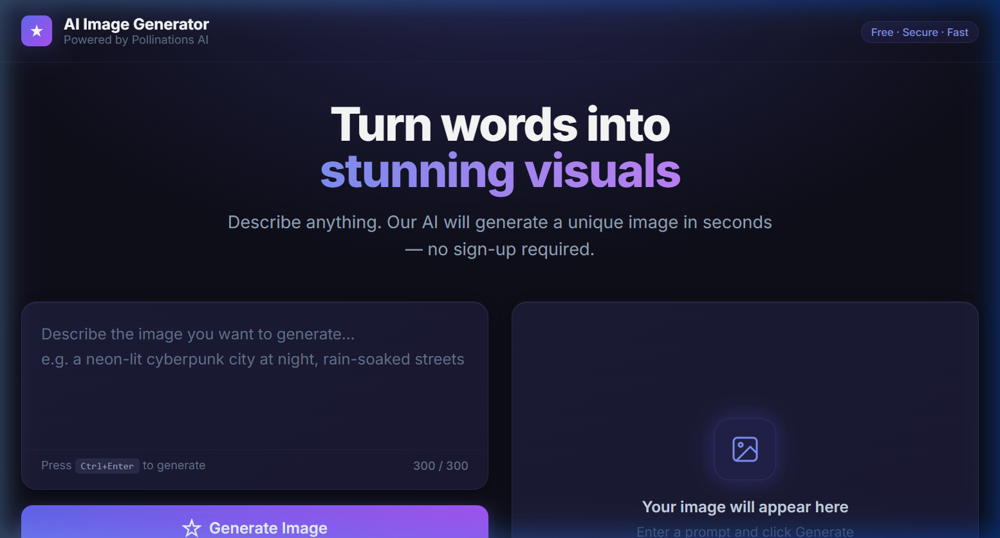
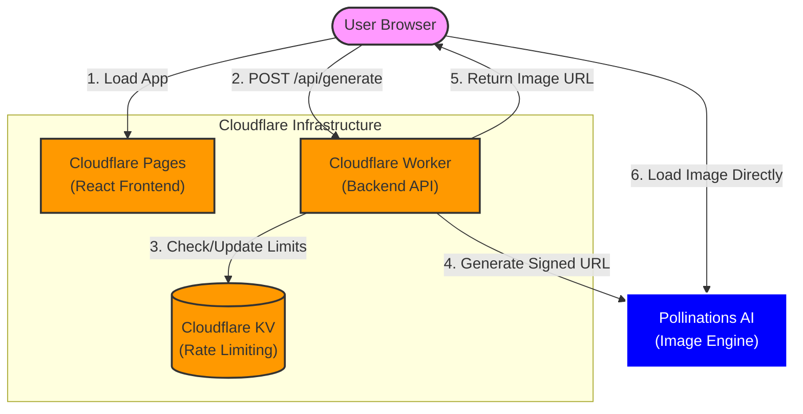

# AI Image Generator

A production-ready AI image generation web app powered by [Pollinations AI](https://pollinations.ai), and deployed on Cloudflare Pages + Workers.

**Live Preview:** [https://main.ai-image-generator-5li.pages.dev](https://main.ai-image-generator-5li.pages.dev)

## Features

- **AI Image Generation**: Turn text prompts into stunning visuals using the Flux model.
- **Quick Try Presets**: Instant generation buttons for popular themes (Cyberpunk, Space, etc.).
- **Secure Backend API**: Worker-based gateway that protects your secret keys.
- **Unique Generations**: Every image is unique thanks to random seed implementation.
- **Global Usage Cap**: Built-in 1,000 images/week global limit via Cloudflare KV.
- **IP-Based Rate Limiting**: Automatic protection against spam (1 req/60s per IP).
- **Responsive UI**: Modern, dark-themed, and glassmorphic design optimized for all devices.
- **Privacy Focused**: No sign-up required, no user data tracking.



## Architecture



The Worker **never** downloads, streams, or proxies the image. This ensures high performance and zero bandwidth costs for your infrastructure.

---

## Project Structure

```
ai-image-generator/
├── index.html              # React frontend entry
├── src/                    # Frontend source (React + Vite + TailwindCSS)
│   ├── App.jsx
│   ├── main.jsx
│   ├── styles.css
│   ├── components/
│   │   ├── PromptInput.jsx
│   │   ├── GenerateButton.jsx
│   │   ├── ImageViewer.jsx
│   │   ├── CooldownTimer.jsx
│   │   └── ErrorMessage.jsx
│   ├── services/
│   │   └── api.js
│   └── utils/
│       └── cooldown.js
├── worker/                 # Cloudflare Worker (TypeScript API)
│   ├── src/
│   │   ├── index.ts
│   │   ├── pollinations.ts
│   │   ├── ratelimit.ts
│   │   └── utils.ts
│   └── wrangler.toml
└── ...
```

---

## Quick Start

### 1. Prerequisites

- Node.js ≥ 18
- [Wrangler CLI](https://developers.cloudflare.com/workers/wrangler/) (`npm i -g wrangler`)
- A Cloudflare account

---

### 2. Deploy the Worker

```bash
cd worker
npm install

# Create KV namespace for rate limiting
npx wrangler kv:namespace create RATE_LIMIT_KV
# → Paste the returned ID into wrangler.toml under [[kv_namespaces]]

# Set secrets (never committed to git)
npx wrangler secret put POLLINATIONS_SECRET_KEY   # your sk_xxxxx

# Deploy
npx wrangler deploy
# → Note the Worker URL: https://ai-image-generator.<your-subdomain>.workers.dev
```

Then edit `wrangler.toml` and set `POLLINATIONS_PUBLIC_KEY` to your `pk_xxxxx`.

---

### 3. Deploy the Frontend

```bash
# From the project root
npm install

# Copy and fill in env variables
cp .env.example .env.local
# Edit .env.local:
#   VITE_WORKER_URL=https://ai-image-generator.<subdomain>.workers.dev

npm run build
# → dist/ folder is ready for Cloudflare Pages
```

Deploy `dist/` to [Cloudflare Pages](https://pages.cloudflare.com) (connect GitHub repo or upload manually).

In Cloudflare Pages settings add the env var:
- `VITE_WORKER_URL`

---

### 4. Local Development

Start the Worker locally:
```bash
cd worker
npx wrangler dev --local
# → API running at http://localhost:8787
```

Start the frontend (dev proxy forwards `/api` → Worker):
```bash
# From the project root
npm run dev
# → Frontend running at http://localhost:5173
```

---

## Security Model

| Concern | Solution |
|---|---|
| Global budget abuse | Hard cap of 1,000 requests per week across the entire app via KV |
| IP-level abuse | KV rate limit: 1 request / 60 s per IP |
| Secret key exposure | Secret key stored only in Worker secrets (never sent to browser) |
| Image bandwidth | Browser loads image directly from Pollinations — Worker never proxies |

---

## Environment Variables Reference

### Worker (`wrangler.toml` / `wrangler secret`)

| Variable | Source | Description |
|---|---|---|
| `MAX_IMAGES_PER_WEEK` | `wrangler.toml [vars]` | Global limit for max images generated per week across all users (default: 1000) |
| `POLLINATIONS_PUBLIC_KEY` | `wrangler.toml [vars]` | Publishable key (`pk_…`) appended to image URLs |
| `POLLINATIONS_SECRET_KEY` | `wrangler secret put` | Secret key (`sk_…`) — never exposed to frontend |
| `RATE_LIMIT_KV` (binding) | `wrangler.toml [[kv_namespaces]]` | KV namespace for IP rate limiting |

### Frontend (`.env.local`)

| Variable | Description |
|---|---|
| `VITE_WORKER_URL` | Deployed Worker URL |
